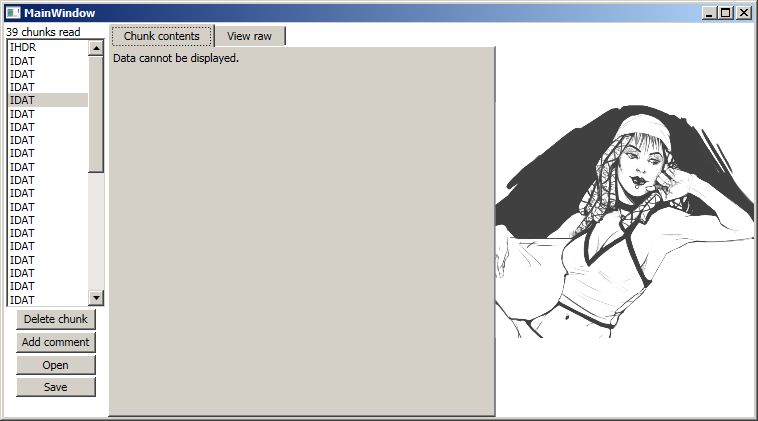
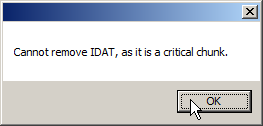
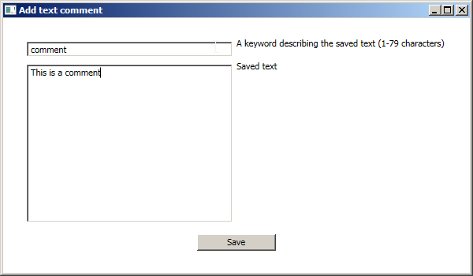
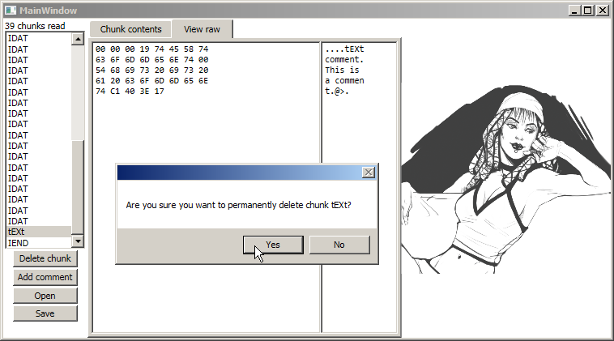

# PngMeta

PNG-metadataeditori

## Toteutetut ominaisuudet

Ohjelma listaa kaiken kuvan sisältämän metadatan.

Ohjelmalla pystyy lukemaan ja muokkaamaan seuraavia dataelementtejä:

tIME - kuvan viimeisin muokkausaika (ei päivity automaattisesti)

tEXt - teksti

iTXt - muu kuin englanninkielinen teksti

Ohjelmalla pystyy vain lukemaan seuraavia dataelementtejä:

IHDR - kuvan resoluutio ja värisyvyys

gAMA - kuvan gammataso

Muita elementtejä on mahdollista lukea heksamuodossa, mutta ei muokata.

Ohjelmalla pystyy lisäämään uusia tEXt-elementtejä.

Ohjelmalla pystyy poistamaan dataelementtejä, jos ne eivät ole välttämättömiä kuvan näyttämiselle.

## Käyttöliittymä

Ohjelman pääkäyttöliittymä. Vasemmalla lista kuvan sisältämistä dataelementeistä, oikealla kuva.

Ohjelma ei suostu poistamaan kriittiseksi merkattua dataa.

Kuviin voi lisätä tekstidataa.

Edellinen kommentti raakamuodossa, ja dialogi sen poistamiselle.

## Tarvittavat tiedostot

Ohjelman mukana tulee joukko PNG-kuvia joilla ohjelman toimintaa voi testata (test images-kansio), mutta ohjelmalla pystyy avaamaan minkä tahansa PNG-spesifikaatiota noudattavan kuvan.

## Tiedossa olevat ongelmat ja jatkokehitys

Useimpien metadataelementtien käsittelyä ei ole toteutettu. Pakattua tekstidatan lukeminen on melko huomattava puute, ja lisäksi esim. kuvan väripalettia ja taustaväriä voisi hyvin olla mahdollista muokata käsin. Datan lisäämistä ei myöskään toteutettu muille kuin yksinkertaisille tEXt-paloille.

## Mitä opin

Byte-taulukoiden pyörittely ja tarkistussummien laskeminen osoittautui helpommaksi kuin WPF-käyttöliittymän luominen. XAML:ia on helppo kirjoittaa, mutta jos jokin ei toiminut, ongelman löytäminen oli yleensä melko hankalaa.

## Ehdotus arvosanaksi

Ohjelma toimii. Kyllä tästä vähintään nelonen pitäisi saada.
